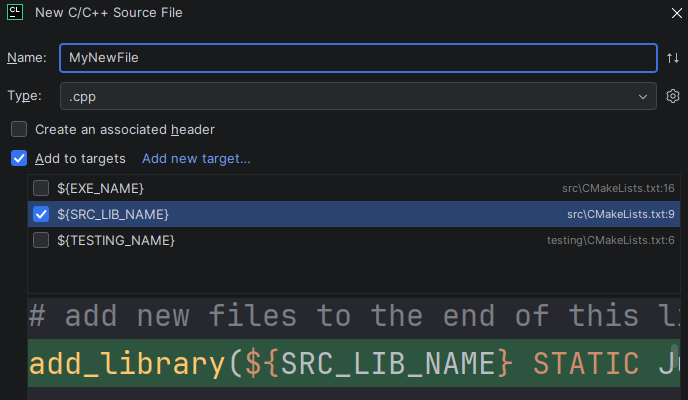

# BattleShip With AIs

## Matthew’s Stats

- Time Taken: ~1 hour
- Lines Of Code: ~200
- Files: 41

## Problem Description
We will be updating our game of Battleship to support 3 different AIs so 
that the user has the option to play against the computer or have the computer play 
against itself.

## Restrictions and Requirements
- You must use **inheritance** on your `Player`s
- You **MUST** have the following inheritance hierarchy in your program
  - Player
    - Human Player
    - AI Player
      - CheatingAI
      - RandomAI
        - SearchAndDestroyAI
- `Player` and `AI Player` should be abstract classes
- You may **NOT** do any `static_cast`s or `dynamic_cast`s on `Player` or any of its children. 
  This of course includes pointers and references.
        
## Input
        
Input will come from 3 locations: the command line, files, and standard input
        
### Command Line

- Argument 1
  - Required
  - The path to the configuration file for this game
  - This value will always be valid
- Argument 2
  - Optional
  - An integer to be used as the seed for the random number generator
  - This value, if provided, will always be valid
  - If the seed is not given the current time should be used
  
### Configuration File
  The same as in the prior assignment

### Standard Input (Keyboard)

At the beginning of the game the player will now pick whether they want to play a
1. Human Vs Human Game
2. Human Vs AI Game
3. AI Vs AI Game

- Human players are created the same as they were in the last assignment. 
  - The way a human player shoots at a location is the same as it was in the last assignment
- If one of the players is an AI, the user will select what type of AI they want to 
  play against.

## Output
The output is a bit too complicated to specify here what it should look like. 
Please look at [the example output](example_game.md) to figure out what it should look like.

## Game Modes

The game can be played in 3 different modes
1. Human vs Human
2. Human vs AI
3. AI vs AI

## Setting Up The Game

### Initializing the Random Number Generator
1. Use a [std::mt19937 random number generator](https://cppreference.com/cpp/numeric/random/mersenne_twister_engine) for your random number generator.
2. Create exactly **ONE** instance of this random number generator in your game and seed it exactly **ONCE**.
3. Make sure that the generator is created and seeded **BEFORE** you use it.

4. A good idea would be to make this generator a static member of your `AIPlayer` class 
   and then initialize it in `main`.

### Human

Humans are created the same way they were in the last game

### AI
Ships are placed in ASCII order based on the character used to represent the ship.

For each ship
1. The AI’s board should be displayed
2. The AI randomly determines if the ship should be placed horizontally or vertically
   - Do this by using a [uniform_int_distribution](https://en.cppreference.com/cpp/numeric/random/uniform_int_distribution)
     with a min of 0 and a max of 1. 
     - 0 means horizontal and 1 means vertical
3. The AI chooses a random starting row and column such that the ship could be placed there 
   without going off the board or overlapping another ship
   1. Create a [uniform_int_distribution](https://en.cppreference.com/cpp/numeric/random/uniform_int_distribution) 
      used to pick out the row 
      1. If the ship is being placed horizontally, 
         the min should be 0 and the max should be the `number of rows in the board - 1`.
      2. If the ship is being placed vertically,
         the min should be 0 and the max should be the `number of rows in the board - the length of the ship`.
   2. Create a [uniform_int_distribution](https://en.cppreference.com/cpp/numeric/random/uniform_int_distribution)
      used to pick out the column
      1. If the ship is being placed horizontally,
            the min should be 0 and the max should be the `number of columns in the board - the length of the ship`.
      2. If the ship is being placed vertically,
         the min should be 0 and the max should be the `number of columns in the board - 1`. 
   3. Randomly generate the row 
   4. Randomly generate the column
   5. If the placement doesn’t overlap with any previously placed ship the ship should be placed there, 
      but if not the process begins again at step 3

This is the area that most students make a mistake. Common mistakes include
1. Picking the row and column in the wrong order
2. Copying the random number generator instead of using the original
   - This most commonly happens by passing a copy of the random number generator to a function instead
     of a reference to the original
3. Creating a new random number generator
4. Reseeding the random number generator

The key idea here is to create one random number generator that is seeded once
and reused whenever a random value is needed.


## AIs

### Naming
- The first AI created is named AI 1. 
- The second AI created is named AI 2.

In a game of a human vs AI, even if the AI is the second player, its name will still be
AI 1.

### Cheating AI
The cheating AI plays a perfect game of BattleShip. It never misses and always hits 
the opponent's ship. The AI shoots at the ships in sequence, starting from the upper 
leftmost corner and working its way across the rows to the lower rightmost corner.  

For example, if the opponent’s board looked like

```terminaloutput
  0 1 2 3 4 5
0 * * * * * *
1 A * * * * *
2 A * * * * *
3 A C * * * *
4 * C * * * *
5 * C B B B *
```

The firing sequence would be (1,0), (2,0), (3,0), (3,1), (4,1), (5,1), (5,2), (5,3), (5,4).


### Random AI

- The random AI randomly guesses locations to fire at on the board. 
- It never guesses the same location twice. 
 
To implement this, do the following 
- When you **create** an instance of a `RandomAI`, generate a `vector` of `std::pair<int,int>`
  representing all the locations to fire at starting from the upper leftmost corner 
  working your way across the rows, and ending at the bottom right most corner
     - The first item in the pair is a row and the second is a column 
- **AFTER** you place your ships, use [std::ranges::shuffle](https://en.cppreference.com/cpp/algorithm/ranges/shuffle) 
  to randomly shuffle the points in your `vector` around
- When you need a firing location, use the location at the **END**
  of your `vector` as the spot to shoot at, then pop it off
  - We use the item at the end because it is much faster to remove an item from the end
    of a vector than it is to remove one from the front
 
    
### Hunt Destroy AI

This AI operates in 2 distinct modes: Hunt and Destroy
  
#### Hunt Mode

In Hunt mode, the AI behaves like the [Random AI](#Random-AI) and randomly 
guesses at locations to shoot. 

As soon as it gets a hit it switches to Destroy mode.

#### Destroy Mode

In Destroy mode, the AI will shoot at all locations around the oldest location hit. 
The AI will fire at the surrounding locations in this order: 
1. Left
2. Up
3. Right
4. Down.

- If any hits are scored they are added to the list a locations to fire at next.
- Locations are only added to list of locations to fire at only if
  - They have not been fired at already
  - We do not plan to fire at them in the future 
- Locations you plan to fire at should be removed from the locations you can randomly
  choose to shoot at in Hunt Mode
- You return to Hunt mode once all of these locations you plan to shoot 
  at in Destroy Mode have been fired at.

#### Example

##### Round 1: Initially In Hunt Mode

```terminaloutput
  0 1 2 3 4 5
0 * * * * * *
1 * * * * * *
2 * * * B B B
3 * * * * * *
```

List of locations to fire at next: `[ ]`

No locations to fire at next so we randomly choose `2, 3` to shoot at

```terminaloutput
  0 1 2 3 4 5
0 * * * * * *
1 * * * * * *
2 * * * X B B
3 * * * * * *
```

Add locations surrounding hit to list to fire at next
1. Left: `(2,2)`
2. Up: `(1,3)`
3. Right: `(2,4)`
4. Down: `(3,3)`

List of locations to fire at next: `[(2,2), (1,3), (2,4), (3,3)]`

##### Round 2: Destroy Mode

List of locations to fire at next: `[(2,2), (1,3), (2,4), (3,3)]`

Choose first location from list of locations to fire at next: `(2,2)` 

```terminaloutput
  0 1 2 3 4 5
0 * * * * * *
1 * * * * * *
2 * * O X B B
3 * * * * * *
```

##### Round 3: Destroy Mode

List of locations to fire at next: `[(1,3), (2,4), (3,3)]`

Choose first location from list of locations to fire at next: `(1,3)`

```terminaloutput
  0 1 2 3 4 5
0 * * * * * *
1 * * * O * *
2 * * O X B B
3 * * * * * *
```

##### Round 4: Destroy Mode

List of locations to fire at next: `[(2,4), (3,3)]`

Choose first location from list of locations to fire at next: `(2,4)`

```terminaloutput
  0 1 2 3 4 5
0 * * * * * *
1 * * * O * *
2 * * O X X B
3 * * * * * *
```

Add locations surrounding hit to list to fire at next
1. Left: Skip. Already fired at `(2,2)`
2. Up: `(1,4)`
3. Right: `(2,5)`
4. Down: `(3,4)`

List of locations to fire at next: `[(3,3), (1,4), (2,5), (3,4)]`

##### Round 5: Destroy Mode

List of locations to fire at next: `[(3,3), (1,4), (2,5), (3,4)]`

Choose first location from list of locations to fire at next: `(3,3)`

```terminaloutput
  0 1 2 3 4 5
0 * * * * * *
1 * * * O * *
2 * * O X X B
3 * * * O * *
```
##### Round 6: Destroy Mode

List of locations to fire at next: `[(1,4), (2,5), (3,4)]`

Choose first location from list of locations to fire at next: `(1,4)`

```terminaloutput
  0 1 2 3 4 5
0 * * * * * *
1 * * * O O *
2 * * O X X B
3 * * * O * *
```

##### Round 7: Destroy Mode

List of locations to fire at next: `[(2,5), (3,4)]`

Choose first location from list of locations to fire at next: `(2,5)`

```terminaloutput
  0 1 2 3 4 5
0 * * * * * *
1 * * * O O *
2 * * O X X X
3 * * * O * *
```

Add locations surrounding hit to list to fire at next
1. Left: Skip. Already fired at `(2,4)`
2. Up: `(1,5)`
3. Right: Skip. `(2,6)` is out of bounds.
4. Down: `(3,5)`

List of locations to fire at next: `[(3,4), (1,5), (3,5)]`

##### Round 8: Destroy Mode

List of locations to fire at next: `[(3,4), (1,5), (3,5)]`

Choose first location from list of locations to fire at next: `(3,4)`

```terminaloutput
  0 1 2 3 4 5
0 * * * * * *
1 * * * O O *
2 * * O X X X
3 * * * O O *
```

##### Round 9: Destroy Mode

List of locations to fire at next: `[(1,5), (3,5)]`

Choose first location from list of locations to fire at next: `(1,5)`

```terminaloutput
  0 1 2 3 4 5
0 * * * * * *
1 * * * O O O
2 * * O X X X
3 * * * O O *
```

##### Round 10: Destroy Mode

List of locations to fire at next: `[(3,5)]`

Choose first location from list of locations to fire at next: `(3,5)`

```terminaloutput
  0 1 2 3 4 5
0 * * * * * *
1 * * * O O O
2 * * O X X X
3 * * * O O O
4 * * * * * *
5 * * * * * *
```

##### Round 11: Return To Hunt Mode

List of locations to fire at next: `[ ]`

No more locations to fire at next so we return to Hunt Mode
and resume guessing at random locations we haven't shot yet.


## Starter Code

The starter code contains my solution to the previous problem where we only had 
Human Players. You are welcome to start from this if you want. If you don't, just delete
what I've given you and put your solution from the prior assignment in.

**Do not turn in my solution for the previous problem.** If you do, it will be considered
cheating. 

## Hints and Musings
- Think about what the different types of` Player`s have in common and what they do differently.
  - The things that are common, can be placed in Player. 
  - The things that they do differently should be made `virtual` so that the children 
    can override them with what they want to do.

## Example

Please see [example_game.md](example_game.md) for an example of gameplay.

## CLion Specifics

### Setting Command Line Arguments
Command line arguments can be set by
1. Going to the configuration you want to add command line arguments to
2. Clicking  `...` next to the configuration
3. Selecting `Edit...`
4. Entering your command line arguments in `Program Arguments`


## What to Submit

Submit to GradeScope a clone of this repository with updates to it to solve the problem described.
You are allowed to create as many new files under `src` or `testing` as you
desire. 

- If you create new files under `src` make sure to add them to `${SRC_LIB_NAME}`
  - 
- If you create new files under `testing` make sure to add them to `${Testing_Name}`
  - 
